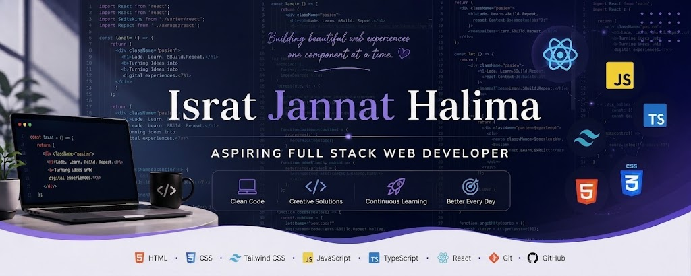

  

# 👋 Hi, I'm Israt Jannat Halima

### 💻 Frontend Developer | Aspiring Full-Stack Developer

---

## 👩‍💻 About Me

Hi, I'm **Israt Jannat Halima** 👋 — a passionate **Frontend Developer** who enjoys creating clean, responsive, and user-friendly web experiences.

I'm currently focused on strengthening my frontend development skills with **JavaScript, TypeScript, and React.js**. My long-term goal is to become a **Full-Stack Developer** and build complete, real-world web applications from frontend to backend.

* 🌱 Currently learning **React.js**
* 💻 Practicing **JavaScript & TypeScript**
* 🎨 Building responsive and user-friendly websites
* 🧠 Improving my problem-solving and programming skills
* 🔧 Practicing **Git & GitHub**
* 🚀 Exploring modern web development technologies
* 🎯 Working toward becoming a **Full-Stack Developer**

---

## 🚀 Current Focus

I'm currently focusing on:

* ⚛️ **React.js**
* 💻 **JavaScript**
* 🔷 **TypeScript**
* 🎨 **Responsive Web Design**
* 🧠 **Problem Solving**
* 🔧 **Git & GitHub**

### 🌐 My Learning Roadmap

**Frontend → React.js → TypeScript → Backend → Database → Full-Stack Development**

---

## 🛠️ Languages & Technologies

### 🌐 Frontend

  

### 🔧 Tools & Version Control

  

### 🖥️ Future Technologies

  

> 🌱 Currently learning frontend technologies and planning to explore backend development step by step.

---

## 📚 Learning Journey

🌱 **Currently Learning**
- React.js
- TypeScript
- Advanced JavaScript
- Responsive Web Development

💻 **Already Working With**
- HTML5
- CSS3
- Tailwind CSS
- JavaScript (ES6+)
- Git & GitHub

🚀 **Next Goal**
- Node.js & Express.js
- REST APIs
- MongoDB & PostgreSQL
- Backend Development
- Full-Stack Development

🎯 **My Goal**

> To continuously improve my skills, build real-world projects, and grow from a **Frontend Developer** into a **Full-Stack Developer**.

## 💻 My Projects

I enjoy learning by building projects and applying what I learn in real-world practice.

### 🌐 Frontend Projects

* 🚀 **Project 1** — Frontend practice project
* 🎨 Responsive website projects
* 💻 JavaScript practice projects
* 🔷 TypeScript problem-solving projects

> 🚧 More exciting projects are coming soon!

---

## 🔗 Connect With Me

  
  &nbsp;&nbsp;
  
  &nbsp;&nbsp;
  

📍 **Location:** Bangladesh
📧 **Email:** [ijannathalima@gmail.com](mailto:ijannathalima@gmail.com)

---

## 📊 GitHub Statistics

  
  

---

## 🔥 GitHub Streak

  

---

## 🏆 GitHub Trophies

  

---

## 🎯 2026 Goals

* 🚀 Become a confident **Full-Stack Developer**
* ⚛️ Build real-world **React.js applications**
* 🔷 Strengthen **JavaScript & TypeScript**
* 🖥️ Learn **Node.js & Express.js**
* 🗄️ Learn **MongoDB & PostgreSQL**
* 🔗 Understand **REST APIs & backend development**
* 🧠 Improve problem-solving and programming logic
* 🌐 Build and deploy real-world full-stack applications
* 🤝 Contribute to open-source projects
* 📚 Keep learning and improving every day

---

## 💡 My Developer Mindset

> **Learn → Practice → Build → Make Mistakes → Improve → Repeat 🔁**

I believe that consistent practice and building real projects are the best ways to become a better developer.

Every line of code is a step forward. 🚀

---

### 💙 Thanks for visiting my profile!

### 🚀 Let's build something amazing together!

