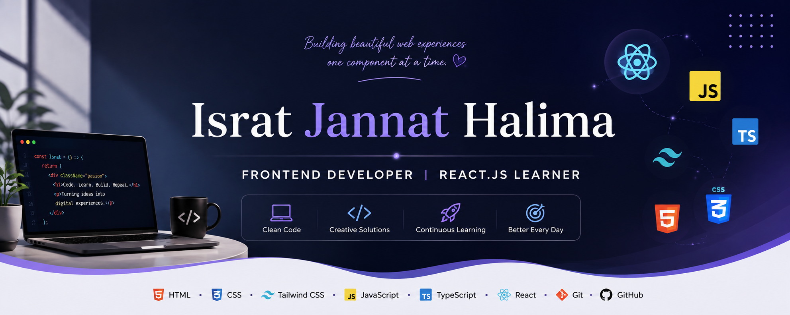

  

# 👋 Hi, I'm Israt Jannat Halima

### 💻 Frontend Developer | React.js Learner

---

## 👩‍💻 About Me

Hi, I'm **Israt Jannat Halima** 👋 — a passionate **Frontend Developer** who enjoys creating clean, responsive, and user-friendly websites.

- 🌱 Currently learning **React.js**
- 💻 Practicing **JavaScript & TypeScript**
- 🛠️ Building small **frontend projects**
- 📚 Improving my **problem-solving and coding skills**
- 🚀 Learning new technologies through practice and projects

---

## 🚀 Current Activities

- 🌱 Learning **React.js**
- 💻 Practicing **JavaScript & TypeScript**
- 🛠️ Building and improving **frontend projects**
- 📚 Strengthening my **coding and problem-solving skills**

---

## 🛠️ Languages and Tools

  

---

## 🔗 Connect With Me

  
  &nbsp;
  
  &nbsp;
  

---

## 📊 GitHub Stats

  

  

---

## 🔥 GitHub Streak

  

---

## 🏆 GitHub Trophies

  

